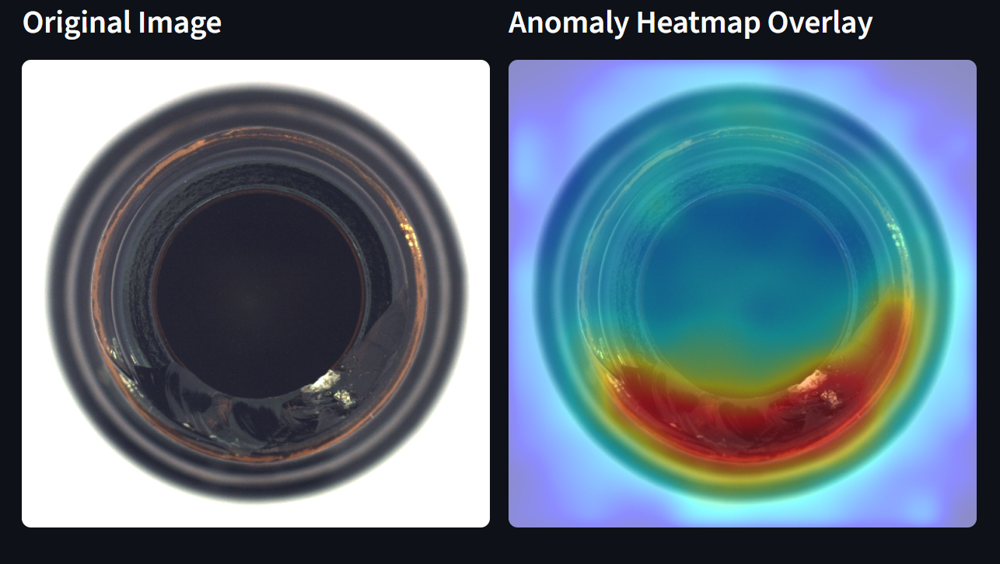
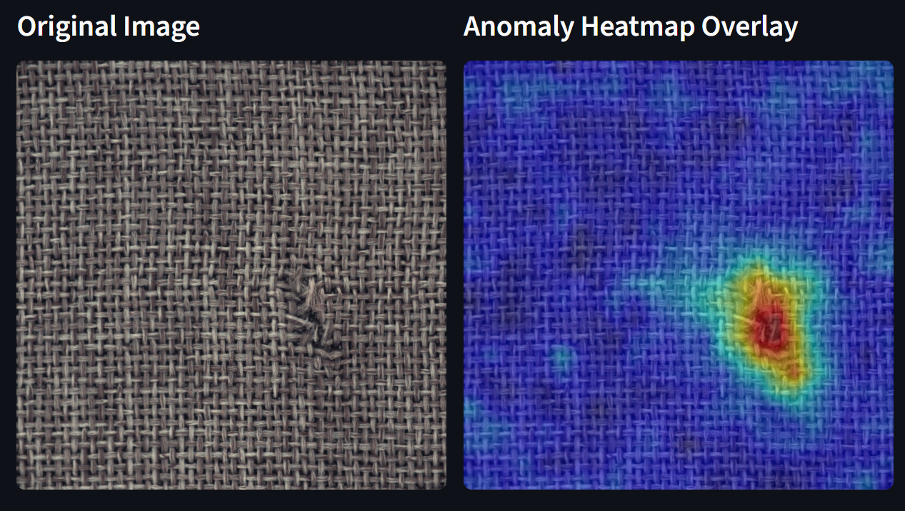
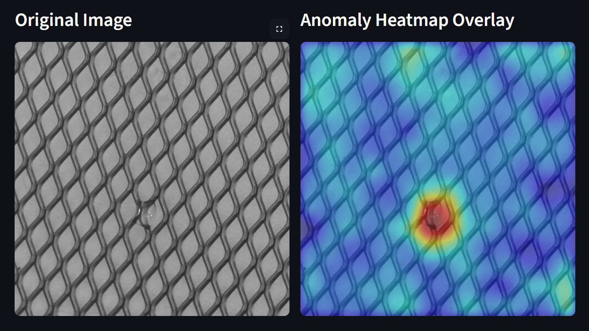
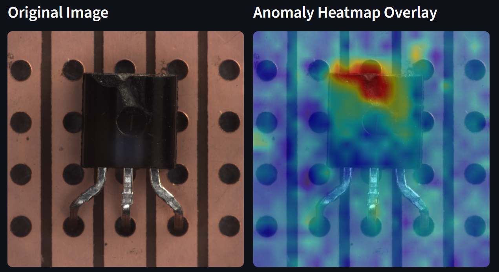

# Edge AOI — Unsupervised Anomaly Detection for Industrial Inspection

A PatchCore-style anomaly detection system built for real manufacturing use cases. No defect labels needed — the model learns what "normal" looks like and flags anything that doesn't fit.

Built with PyTorch, WideResNet50, coreset memory banks, and a live Streamlit UI.

**Mean Image AUROC: 0.9781 across all 15 MVTec categories.**

---

## Demo

[](https://www.youtube.com/watch?v=YOUR_VIDEO_ID)


---

## How it works

Most industrial anomaly detection research assumes you have labeled defect images. In practice, that's rarely true. Defects are rare, inconsistent, and expensive to annotate. Normal samples are easy to collect.

This project takes that constraint seriously:

1. Extract patch-level features from normal training images using a pretrained WideResNet50
2. Store those features in a coreset memory bank on disk (10x compressed)
3. At inference, compare each test image's patches against the memory bank via nearest-neighbor distance
4. Assign an anomaly score and generate a localization heatmap

The result is a system that generalizes to unseen defect types without ever training on them.

---

## Results

### All 15 Categories — 224px Resolution

| Category | Image AUROC | Pixel AUROC | F1 | Threshold |
|----------|------------:|------------:|---:|----------:|
| bottle | 1.0000 | 0.9452 | 1.0000 | 0.6492 |
| cable | 0.9983 | 0.9214 | 0.9840 | 0.7019 |
| capsule | 0.9458 | 0.9332 | 0.9636 | 0.4484 |
| carpet | 0.9952 | 0.9517 | 0.9778 | 0.6055 |
| grid | 0.9616 | 0.9653 | 0.9558 | 0.5670 |
| hazelnut | 1.0000 | 0.9504 | 1.0000 | 0.7932 |
| leather | 1.0000 | 0.9864 | 1.0000 | 0.6544 |
| metal_nut | 0.9995 | 0.9190 | 0.9947 | 0.6817 |
| pill | 0.9607 | 0.8400 | 0.9541 | 0.6071 |
| screw | 0.8832 | 0.8890 | 0.9143 | 0.5676 |
| tile | 0.9917 | 0.9189 | 0.9940 | 0.6999 |
| toothbrush | 0.9889 | 0.9268 | 0.9677 | 0.6100 |
| transistor | 0.9996 | 0.7878 | 0.9877 | 0.6932 |
| wood | 0.9816 | 0.9199 | 0.9587 | 0.7208 |
| zipper | 0.9648 | 0.9272 | 0.9551 | 0.5015 |
| **Mean** | **0.9781** | **0.9188** | **0.9738** | — |

### Resolution Experiment — 224px vs 384px

Higher resolution doesn't always win. Results across 5 categories:

| Category | Image AUROC 224px | Image AUROC 384px | Pixel AUROC 224px | Pixel AUROC 384px |
|----------|------------------:|------------------:|------------------:|------------------:|
| bottle | 1.0000 | 0.9992 | 0.9452 | 0.9648 |
| carpet | 0.9952 | 0.9976 | 0.9517 | 0.9587 |
| grid | 0.9616 | 0.9841 | 0.9653 | 0.9894 |
| capsule | 0.9458 | 0.9597 | 0.9332 | 0.9307 |
| transistor | 0.9996 | 0.9837 | 0.7878 | 0.7271 |

**Why 224px is the default across all 15 categories:**
- 384px is not consistently better — transistor pixel AUROC *dropped* from 0.7878 → 0.7271 at higher resolution
- 384px produces ~3x more patches per image, meaning ~3x slower inference and a ~3x larger memory bank
- For most categories the accuracy gain is marginal (carpet: +0.007) — not worth the compute cost
- This experiment was run specifically to validate 224px as the right default, not to guess it

The resolution is configurable per category in `config.py`. For a production deployment on a texture-heavy category like grid, switching to 384px is a one-line change.

---

## UI Examples

### Bottle — Contamination Defect (Object-Level)


The bottom of the bottle has a contamination defect. The heatmap pinpoints the exact damaged region in red/orange while the clean surface stays blue. The model has never seen a defective bottle — it flags this purely because it deviates from normal.

---

### Carpet — Thread Pull Defect (Texture-Level)


A small pulled-thread defect in the woven fabric. In the original image it's easy to miss — in the heatmap it shows up as a sharp red hotspot with precise localization. Texture categories like carpet are harder because the whole surface looks similar, yet the model isolates the exact damaged patch.

---

### Grid — Broken Pattern (Fine Texture)


A subtle break in the repeating diamond grid pattern. Nearly invisible in the original image, but the heatmap concentrates the anomaly score exactly on the damaged cell. Grid is one of the hardest MVTec categories — pixel AUROC jumps from 0.9653 at 224px to 0.9894 at 384px, showing resolution matters most for fine textures.

---

### Transistor — Misplaced Component (Electronics)


A transistor with a defect at the top of the component — likely a bent or missing lead. The heatmap lights up the top section in red while the rest of the board scores low. Image AUROC of 0.9996 means near-perfect detection at the image level.

---

## Architecture

**Backbone:** WideResNet50_2 pretrained on ImageNet. Features extracted from `layer2` and `layer3`, pooled to the same spatial resolution, concatenated, and L2-normalized. Each spatial location becomes a patch embedding.

**Training:** All patch embeddings from normal images are collected into a memory bank. A greedy coreset algorithm compresses it to ~10% of its original size while keeping the most representative vectors.

**Inference:** Each patch is matched against the coreset via `torch.cdist`. The max patch distance becomes the anomaly score. Patch scores are reshaped into a grid, upsampled to image resolution, and smoothed with a Gaussian kernel.

### Memory Bank Compression

| Category | Full Bank | Coreset | Reduction |
|----------|----------:|--------:|----------:|
| bottle | 81,928 | 8,193 | 10x |
| cable | 87,808 | 8,781 | 10x |
| capsule | 85,848 | 8,585 | 10x |
| carpet | 109,760 | 10,976 | 10x |
| grid | 103,488 | 10,349 | 10x |
| hazelnut | 153,272 | 15,328 | 10x |
| leather | 96,040 | 9,604 | 10x |
| metal_nut | 86,240 | 8,624 | 10x |
| pill | 104,664 | 10,467 | 10x |
| screw | 125,440 | 12,544 | 10x |
| tile | 90,160 | 9,016 | 10x |
| toothbrush | 23,520 | 2,352 | 10x |
| transistor | 83,496 | 8,350 | 10x |
| wood | 96,824 | 9,683 | 10x |
| zipper | 94,080 | 9,408 | 10x |

10x smaller with negligible AUROC drop. The coreset keeps full coverage without the memory overhead.

---

## Project Structure

```
edge_aoi/
├── src/
│   ├── config.py          # All hyperparameters and paths
│   ├── models.py          # WideResNet feature extractor with hooks
│   ├── preprocess.py      # Image and mask transforms
│   ├── data_loader.py     # MVTec dataset loader
│   ├── build_memory.py    # Build baseline + coreset memory banks
│   ├── inference.py       # AnomalyDetector class
│   ├── evaluate.py        # Full evaluation pipeline
│   ├── metrics.py         # AUROC, AP, F1, confusion matrix
│   ├── visualization.py   # Heatmap, overlay, ROC/PR plots
│   ├── benchmark.py       # Latency benchmarking
│   ├── ablation.py        # Backbone / bank / feature ablations
│   └── utils.py           # Logging, seeding, device resolution, JSON I/O
├── app/
│   └── ui.py              # Streamlit web UI
├── run_all.py             # Run all 15 categories end-to-end
└── requirements.txt
```

---

## Quick Start

### 1. Clone and install

```bash
git clone https://github.com/manideepreddyyanala4-svg/edge-aoi-anomaly-detection.git
cd edge-aoi-anomaly-detection
pip install -r requirements.txt
```

### 2. Download MVTec AD dataset

Get it from [mvtec.com/company/research/datasets/mvtec-ad](https://www.mvtec.com/company/research/datasets/mvtec-ad) and place it at:

```
data/mvtec/<category>/train/good/
data/mvtec/<category>/test/<defect_type>/
data/mvtec/<category>/ground_truth/<defect_type>/
```

### 3. Build memory banks

```bash
# Single category
python -m src.build_memory --category bottle

# All 15 categories
python run_all.py
```

### 4. Evaluate

```bash
python -m src.evaluate --category bottle
```

Outputs: Image AUROC, Pixel AUROC, F1, ROC/PR curves, false positive/negative examples, pixel-level CSV report.

### 5. Launch the UI

```bash
streamlit run app/ui.py
```

### 6. Benchmark and ablate

```bash
python -m src.benchmark   # latency per category
python -m src.ablation    # ResNet18 vs WideResNet50, layer configs, bank sizes
```

---

## Tech Stack

| Tool | Role |
|------|------|
| PyTorch | Feature extraction, coreset sampling, nearest-neighbor search |
| TorchVision | WideResNet50_2 pretrained backbone |
| scikit-learn | AUROC, AP, F1, threshold tuning |
| OpenCV + Matplotlib | Heatmap rendering and visualization |
| Streamlit | Live inspection UI |
| Pandas | Dataset inspection and CSV reporting |

---

## Dataset

[MVTec AD](https://www.mvtec.com/company/research/datasets/mvtec-ad) — Paul Bergmann et al., CVPR 2019.

15 categories covering a wide range of difficulty — from easy object-level defects (bottle, hazelnut) to hard texture-level ones (grid, screw) — which makes it a solid test of how well the approach actually generalizes.

---

## Why I built this

Unsupervised anomaly detection is one of the most practical problems in industrial computer vision — you almost never have defect labels in production. This project is my attempt at a clean, reproducible implementation that actually works on a standard benchmark and can be tested visually in real time.

---

## License

MIT
